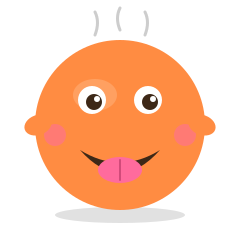

<div align="center">



# 🍽️ 식충이 (Sikchungi)

**"오늘 뭐 먹지...?"** 라는 일상의 고민을, 잼민이 톤으로 시원하게 해결해주는 음식 추천 AI 에이전트 🤤

[](https://nextjs.org)
[](https://www.typescriptlang.org)
[](https://tailwindcss.com)
[](https://ai.google.dev)
[](https://vercel.com)

</div>

---

## 🍔 식충이가 뭔데요?

배고픈데 뭐 먹을지 모르겠을 때, **너의 상황을 듣고 음식 3개를 이유와 함께 추천**해주는 친근한 AI 친구임.

잼민이 톤이라 격식 없고, 안 끌리면 다른 거 또 추천해줘서 결정장애 졸업 가능 🔥

```
나: 점심 뭐 먹지...
식충이: ㅇㅋ 점심임? 지금 배 얼마나 고픔? 살짝? 아니면 개고픔?? 🤤
나: 개고픔
식충이: 헐 그럼 김치찌개 ㄱㄱ — 든든하고 따뜻함 ㄹㅇ
```

---

## ✨ 핵심 기능

- 🗣️ **대화형 컨텍스트 수집** — 딱딱한 폼 X, 잼민이 친구처럼 자연스럽게 캐물음
- 🍱 **음식 3개 + 이유 + 사진** — Unsplash에서 실제 음식 사진까지 같이
- 🔄 **재추천** — "이거 말고 다른 거 ㄱㄱ" 한 마디면 끝
- 📱 **모바일 친화** — 출근길/퇴근길 가볍게 굴리기 좋음

---

## 🛠️ 기술 스택

| 영역 | 사용 기술 |
|---|---|
| 프레임워크 | Next.js 16 (App Router) + TypeScript |
| 스타일링 | Tailwind CSS v4 + shadcn/ui |
| AI | Gemini 2.5 Flash (`@google/genai`) |
| 이미지 | Unsplash API |
| 위치/식당 | Kakao Local REST API |
| 배포 | Vercel |

---

## 🚀 시작하기

```bash
# 1. 클론
git clone https://github.com/leesanghyupp/sikchungi.git
cd sikchungi

# 2. 의존성 설치
npm install

# 3. 환경변수 셋업
cp .env.example .env.local
# .env.local 열어서 두 키를 채워넣어주세요 👇

# 4. 키 동작 확인 (선택)
node --env-file=.env.local scripts/test-keys.mjs

# 5. 개발 서버 실행
npm run dev
```

### 🔑 필요한 API 키 (둘 다 무료)

| 키 | 발급 위치 |
|---|---|
| `GOOGLE_API_KEY` | [Google AI Studio](https://aistudio.google.com) — 카드 등록 X, 즉시 발급 |
| `UNSPLASH_ACCESS_KEY` | [Unsplash Developers](https://unsplash.com/developers) — 시간당 50req 무료 |
| `KAKAO_REST_API_KEY` | [Kakao Developers](https://developers.kakao.com) — 일일 30만 req 무료 (근처 식당 검색용) |

---

## 📂 프로젝트 구조

```
sikchungi/
├── 📄 기획서.md              # 프로젝트 기획서 (v1.1)
├── 🎨 assets/mascot.svg      # 식충이 마스코트
├── 🧪 scripts/test-keys.mjs  # API 키 동작 테스트
├── 📦 src/                   # Next.js App Router 코드
└── 🌐 public/
```

---

## 🗺️ 로드맵

| Phase | 항목 | 상태 |
|---|---|---|
| 🏗️ 셋업 | 기획서 + 마스코트 + Next.js + 키 발급 | ✅ |
| 1️⃣ MVP | 채팅 UI + 시스템 프롬프트 + 추천 카드 | ⏳ |
| 1️⃣ MVP | Vercel 배포 (`sikchungi.vercel.app`) | ⏳ |
| 2️⃣ 확장 | 위치 기반 근처 식당 추천 | 📌 예정 |
| 3️⃣ 확장 | 냉장고 재료 기반 / 영양 정보 | 💭 검토 |

---

## 🧠 작동 원리 (한 줄 요약)

```
사용자 발화 → 식충이가 컨텍스트 수집 (대화) → Gemini가 음식 3개 추천 (구조화 출력)
                                              ↓
                                          Unsplash에서 음식 사진 매칭
                                              ↓
                                          예쁜 카드 3장으로 출력 🍽️
```

---

<div align="center">

**🍴 made with 🤤 by [@leesanghyupp](https://github.com/leesanghyupp)**

> ㅇㅈ? ㄴㄴ ㄱㅇㅇ? — 결정 못하겠으면 식충이가 골라줌

</div>
